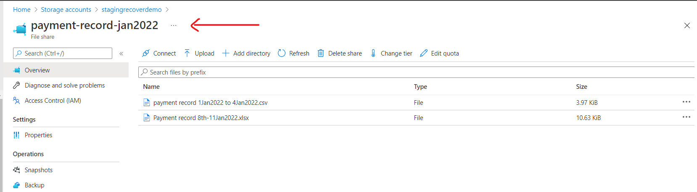
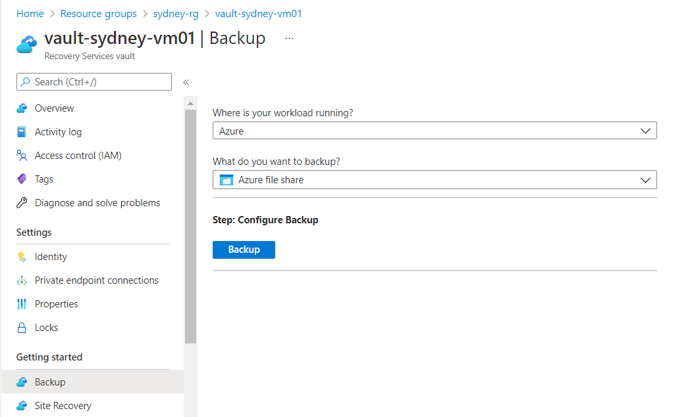
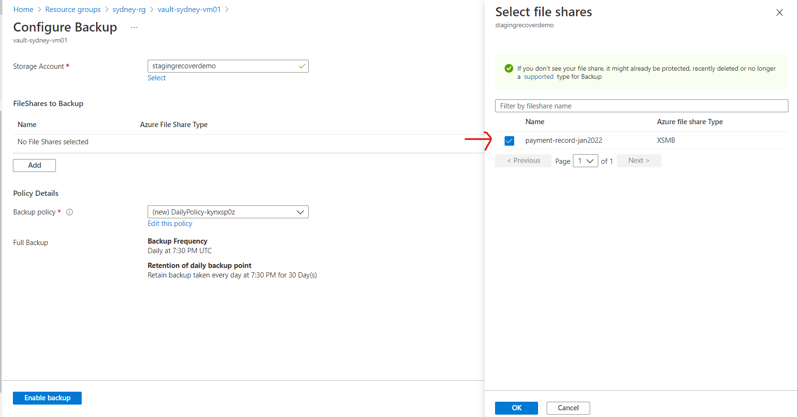
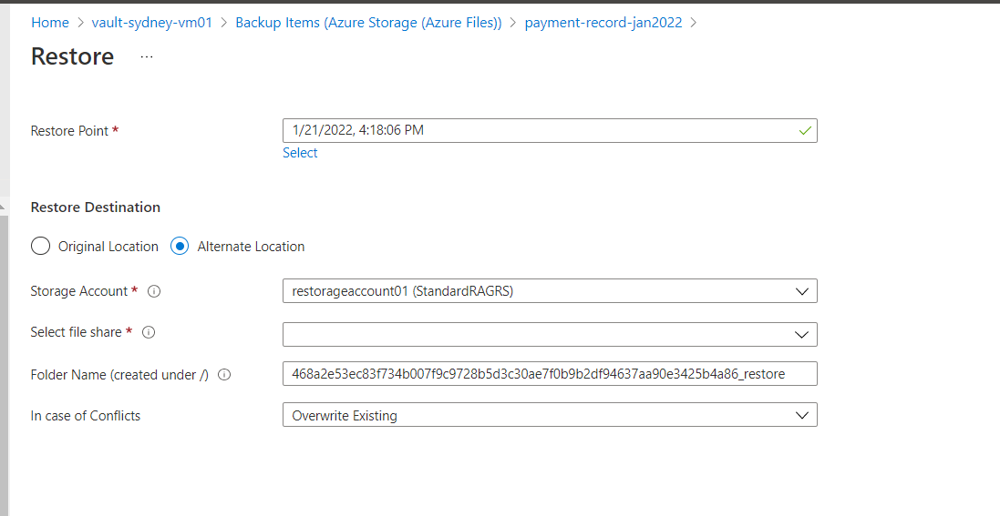
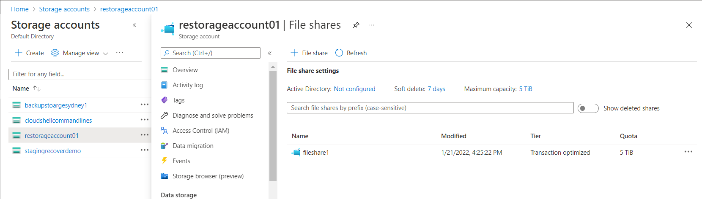
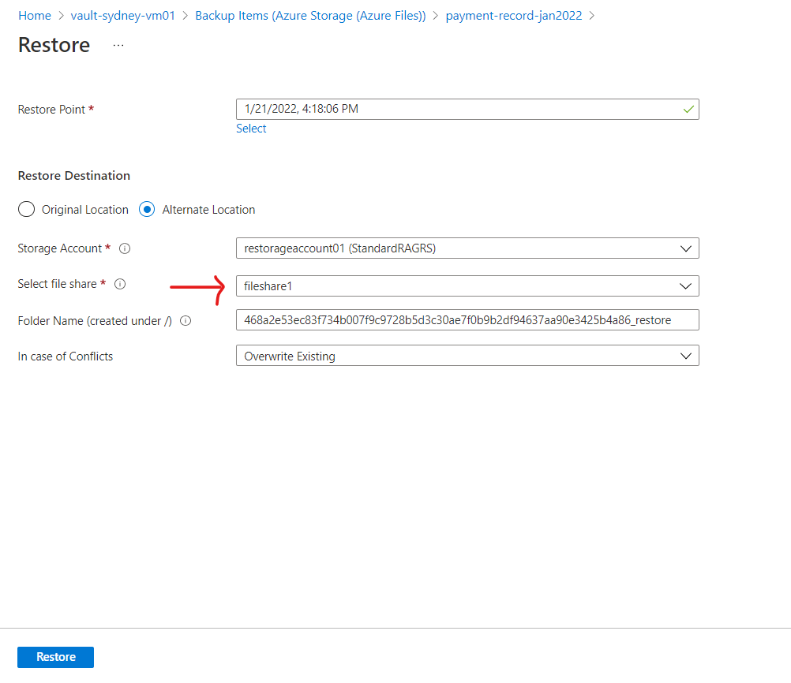
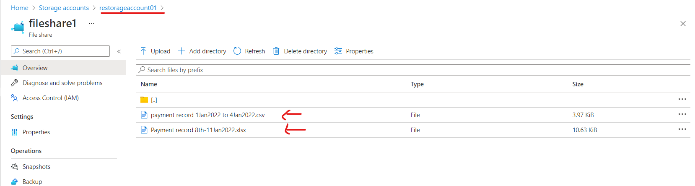

# Azure-FileShare-Backup-And-Restore
This hands-on lab, I am going to demonstrate how to restore File Share from Azure Backup to another storage account.

Scenario: My company needs to recover data from a file share, but they do not want to overwrite existing data. I must find a way to restore the file share to a separate storage account, so they can access the data there. 
I have been asked with copying the date to another storage account as a restore location.
I will use the existing Recover Services vault to restore the data to another storage account.

Pre-requisite: We have an existing storage account ‘stagingrecoverdemo’  and a Recovery Services vault 'vault-sydney-vm01'.
Go to the storage account ‘stagingrecoverdemo’ and check what files are in the File Shares. Here is my file share folder.

Step 1: Create and configure a Backup
•	Create a new storage account and name it as ‘restorageaccount01’ that we want to restore the backup. Make sure you select the same region as the Recovery Services vault’s (mind one is in East US).
•	Now let’s go to Recover Services vault and do the backup Azure file share and configure backup Azure file share.

Configure Backup

After than go to vault-sydney-vm01 | Backup items, then select Azure storage and select payment-record-jan2022 and click Backup now and click on Ok.

Step 2: Restor File Share
Click on Restore Share, and select on the restore point that we just created and click Ok

Now we are going to create a File Share in the that storage account 'restorageaccount01', file share name ‘fileshare1’,

Next, we can add the file share and click Restore

Now let’s go back to the storage account ‘fileshare1’ and check there. Here you go! There are files restored to a different storage account. We are now completed this hands-on lab.

